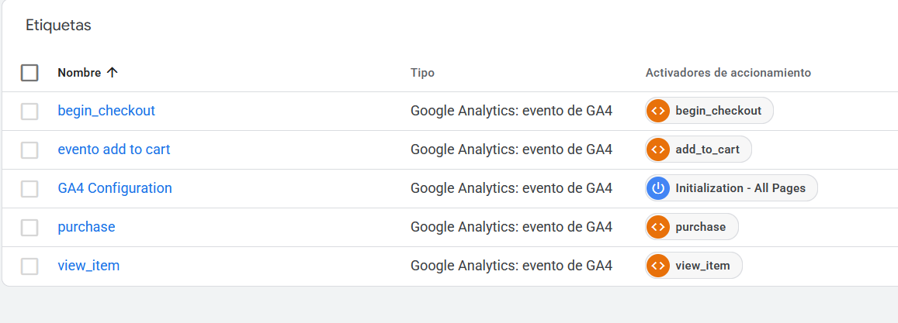
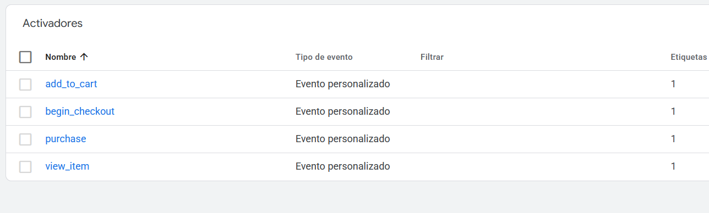
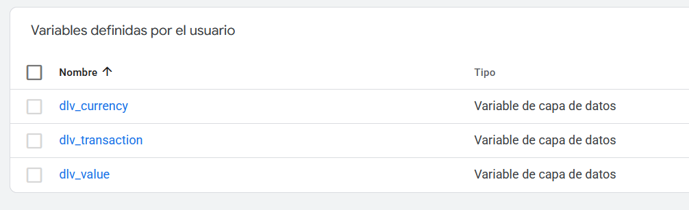
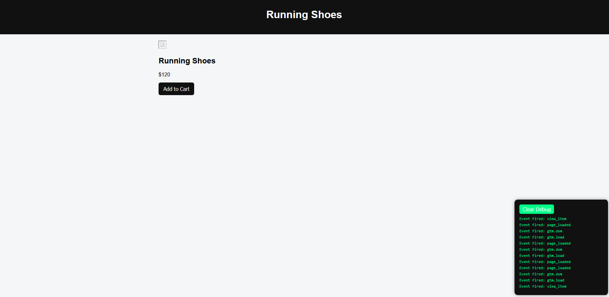

# 🛒 GA4 Ecommerce Tracking Simulation

A frontend demo project that simulates an ecommerce funnel and demonstrates how tracking events are implemented using Google Tag Manager (GTM) and Google Analytics 4 (GA4).

🔗 **Live Demo:**  
[https://ecommerce-tracking-simulation.vercel.app](https://ecommerce-tracking-simulation.vercel.app/)

---

## 🚀 Project Goal

This project focuses on **analytics implementation**, not building a full ecommerce platform.

It demonstrates how user interactions are tracked through a typical ecommerce journey.

---

## 🧭 Simulated Funnel

Home → Product Page → Cart → Checkout → Purchase

---

## 📊 Implemented Tracking Events

- view_item
- add_to_cart
- begin_checkout
- purchase

Events are pushed into the **dataLayer** and processed via GTM.

---

## 🔧 Google Tag Manager Setup

This project uses Google Tag Manager to capture ecommerce events.

Configuration summary:

Tags:
- GA4 Configuration Tag
- GA4 Event Tags (view_item, add_to_cart, begin_checkout, purchase)

Triggers:
- Custom Events based on dataLayer events

Variables:
- Data Layer Variables for ecommerce parameters

---

### GTM Configuration Example

### Tags

### Triggers

### Variables

---

## 🧱 Architecture

Website → dataLayer → Google Tag Manager → Google Analytics 4

---

## ⚙️ Features

- Dynamic product rendering
- Single reusable product page
- GA4 ecommerce event structure
- Custom debug panel
- Persistent event history using localStorage
- Automatic dataLayer event listener

---

## 🛠 Tech Stack

- HTML
- CSS
- JavaScript (Vanilla JS)
- Google Tag Manager
- Google Analytics 4

---

Events validated using:
- GTM Preview Mode

---

## 📸 Demo Preview

### Home Page

### Product Page

---

## 🎯 Learning Focus

This project demonstrates skills related to:

- Web analytics implementation
- Tracking architecture
- Marketing technology integrations
- Debugging analytics events

